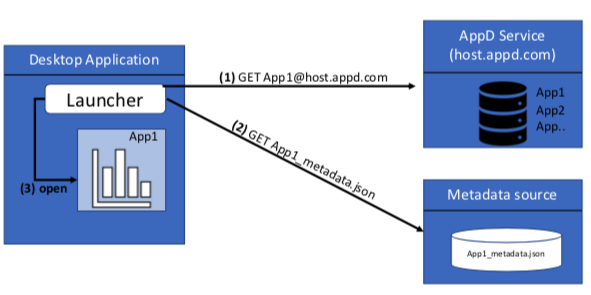
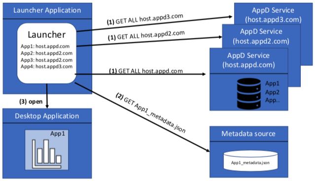

# App Directory Use

An application directory (AppD) provides information about an application's
identifiers, intents that provide contexts, and location of metadata providing
information specific to the launching and integration of the application.

In the real world the AppD would support many use cases as defined in the
[FDC3 Use Cases](use-cases/use-cases-intro)

The following provides some common use cases and benefits.

## Embedded Launcher
A desktop application has the ability to launch (or initialize) an application
by retrieving all necessary data via a REST call(s) to an AppD service
and metadata location. As described in the [AppD Discovery](/AppD_Discovery)
section, this call requires an application identifier (app1@host.appd.com),
which can be used to both locate the AppD service and key to retrieve the
specific application data. The resulting application data will describe the
application and the metadata URI or the actual
metadata in JSON format. If the metadata is a URI, the launcher would
retrieve the metadata file from the URI.

## Standalone Launcher

In more advanced cases, there could be a need to execute different types
of desktop applications, such as web browser or general native application
(exe, binary). A common approach to support this pattern would be to
create a standalone launcher application that has the ability to query
application data from the AppD and executes the desktop application that
can run the required application. This is also convenient if you wanted
to display all possible applications to launch in a single view.

## Aggregated View

There could be many different AppD service instances in the world providing
application data zoned to the provider or enterprise deployment. The
AppD specification allows for unique instances of the service with no
requirement to aggregate data or define a structured hierarchy. With this
said, a launcher might want to construct an aggregated view of applications
from one or more AppD instances. In this case, the launcher would be
required to retrieve multiple application definitions from one or more
AppD instances providing a consolidated view of all applications required.
Today there is no intention to create a single registry of known AppD
instances, so there is an assumption that the launcher will have prior
knowledge of the AppD instance location (FQDN).

## Enhancing controls

The AppD API specification defines the optional use of an access token to
identify the requesting user/launcher and implement authorizations around
AppD actions can be performed. Actions are considered standard CRUD operations.
Again the specification does not define or make mandatory any authorizations
or roles that a provider or enterprise can define.

With this said, it is highly recommended that the implementation take advantage
and utilize an access token to support these controls. In most cases simple
use of roles like "admin" and "user" would be adequate to create separation
between producer and consumer.

Alternatively a more open approach can be defined, where producers of a new
definition are automatically set to "owner" of the the definition.

In more advanced use cases, actual entitlements can be applied to limit
access to specific applications and associated actions based on the source
user/launcher identity.

In all examples, it is up to the implementation to define and engineer the solution
based on individual requirements. There are too many variations in approach
and technology to define a single specification.

## Reference Implementation

### AppD POC
Please view readme on the [AppD POC GitHub](https://github.com/FDC3/appd-poc) .

### Launcher

TBD